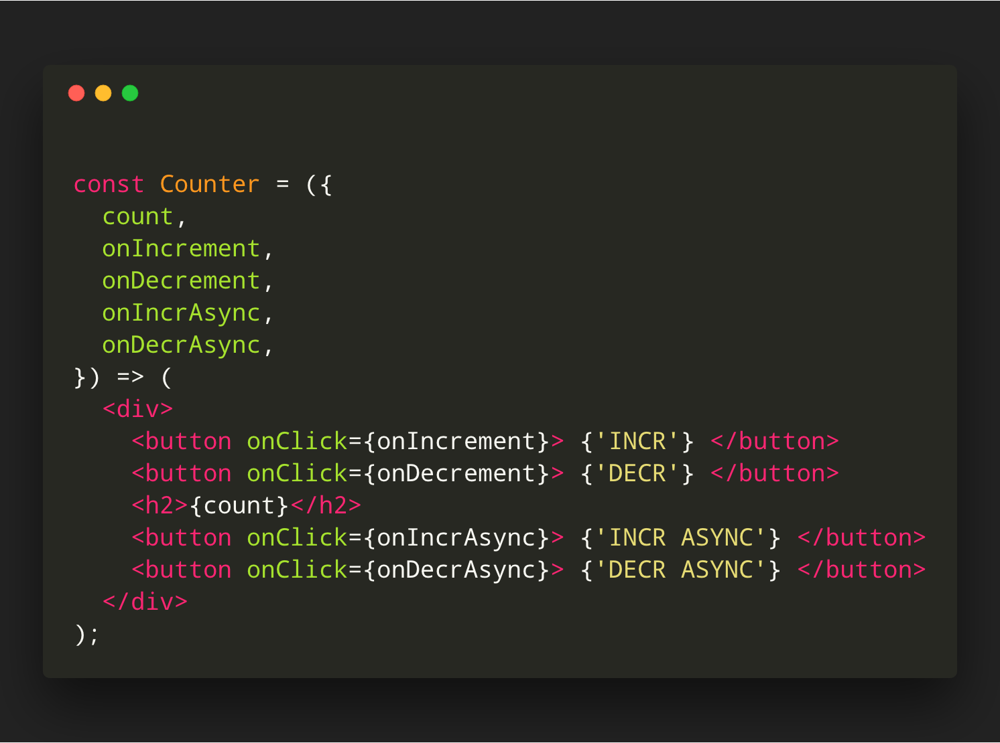
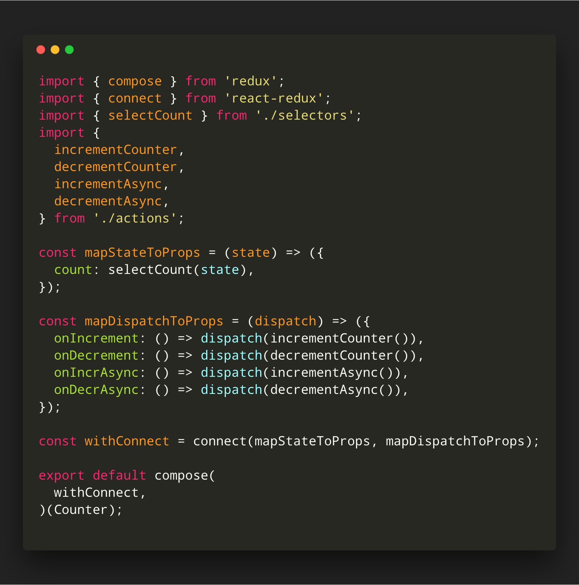
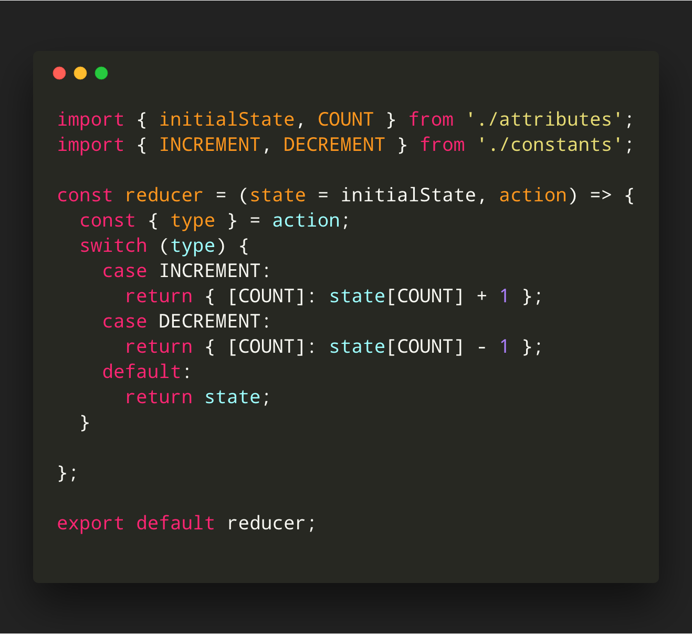
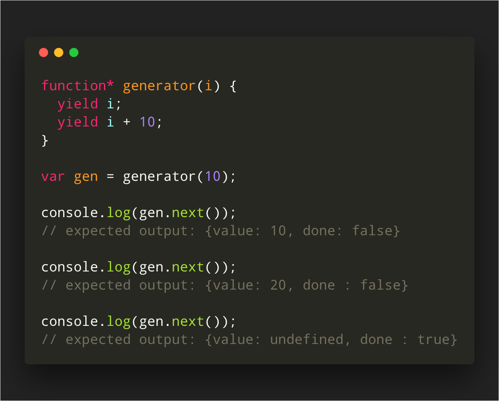
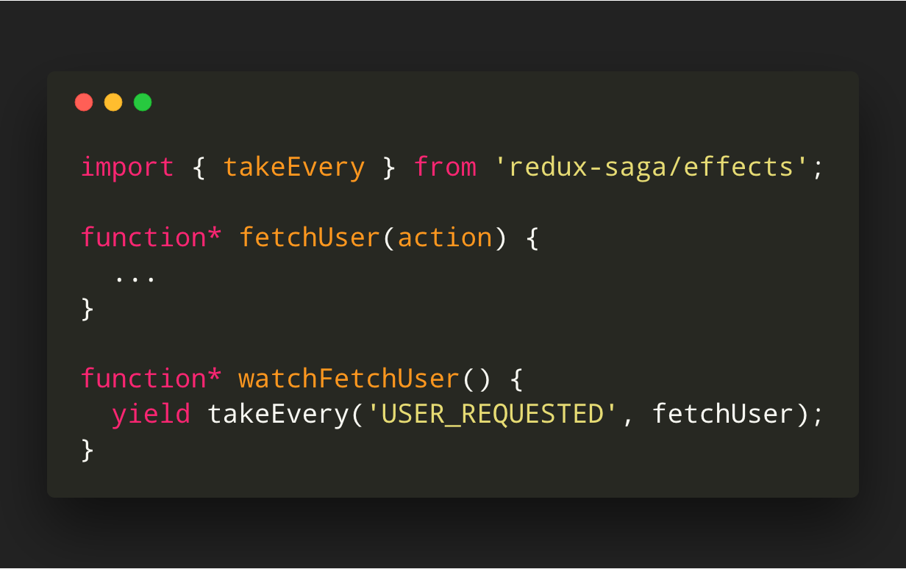
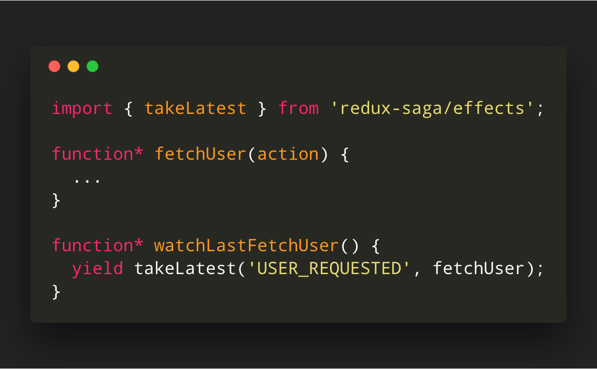
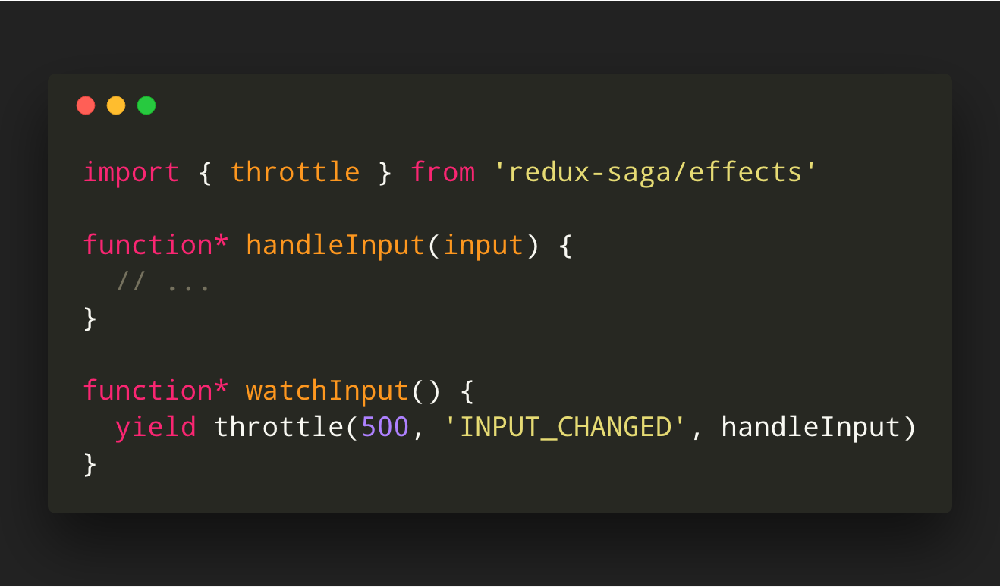
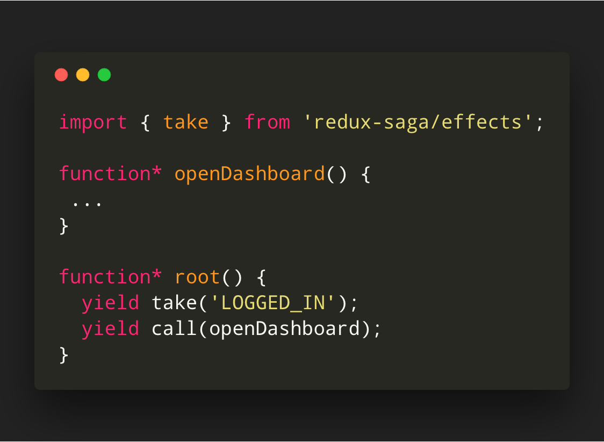

## A saga of Redux-saga


---

## About me

* Full Stack Enginner.
* @ NestAway Techonologies.
* Novice Open Source Contributor ( NodeJS, VSCode ).
* I ️ ❤️   everything JS.
* Design patterns nerd and book-worm 📒 🐛.

---

<a href="https://github.com/shobhitchittora" style="color: lightgrey; ">

shobhitchittora</a>


<a href="https://twitter.com/shobhitchittora">

@shobhitchittora</a>

<a href="https://stackoverflow.com/users/9255238/shobhit-chittora" style="color: orange; ">

shobhit-chittora</a>

<a href="https://medium.com/@chittorashobhit" style="color: lightgreen; ">

@chittorashobhit</a>

---

## What is Redux-saga ?

<p style="font-weight: bold; margin-top: 70px;"> &quot; Redux-saga is a side-effect management library for Redux applications. &quot; </p>

---

## Demo

---



---



---



---

## What are side-effects ?

---

## What are Pure functions ? 

1. The function always returns the same result if the same arguments are passed in. (It does not depend on any state, or data, change during a program’s execution. It must only depend on its input arguments.)

2. The function does not produce any observable side effects such as network requests, input and output devices, or data mutation.

---

## What is a saga ?

<p style="font-weight: bold; margin-top: 70px;"> &quot; Sagas are implemented as Generator functions that yield objects to the redux-saga middleware. &quot; </p>

---

## Crash course - Generators

<p style="font-weight: bold; margin-top: 70px;"> &quot; The ```function*```  declaration defines a generator function, which returns a Generator object. 
 &quot; </p>

---



---

<p style="font-weight: bold; margin-top: 70px;"> &quot; Generators are functions which can be exited and later re-entered. Their context (variable bindings) will be saved across re-entrances.
 &quot; </p>

---

## What can this help me ? 

* Separation of concerns.
* Better testability.
* Readability.
* Co-location.
* Code sharing and re-use.

---

## Useful Effects


---

<h3 style="text-transform: none;">takeEvery</h3>

takeEvery(pattern, saga, ...args)



---

<h3 style="text-transform: none;">takeLatest</h3>

takeLatest(pattern, saga, ...args)

* cancels any previous saga task started previous if it's still running.



---

<h3 style="text-transform: none;">throttle</h3>

throttle(ms, pattern, saga, ...args)



---

<h3 style="text-transform: none;">take</h3>

take(pattern)



---

<h3 style="text-transform: none;">put</h3>

put(action)


---

<!-- .slide: data-background="https://media.giphy.com/media/l0MYDGA3Du1hBR4xG/giphy.gif" -->

---

<!-- .slide: style="text-align: left;" -->
# THE END