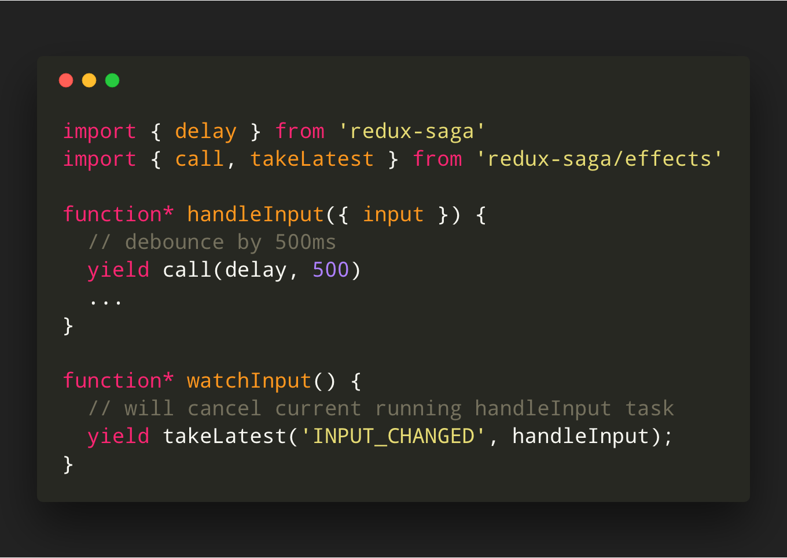

## A saga of Redux-saga


<aside class="notes">
		Hi everyone! How are you doing today. 
    Let's have quick round of applause for the all the speakers today and the organizers, who help bring together such a great community.
</aside>

---

## About me

* Full Stack Enginner.
* @ NestAway Techonologies.
* Novice Open Source Contributor ( NodeJS, VSCode ).
* I ️ ❤️   everything JS.
* Design patterns nerd and book-worm 📒 🐛.

---

<a href="https://github.com/shobhitchittora" style="color: lightgrey; ">

shobhitchittora</a>

<a href="https://twitter.com/shobhitchittora">

@shobhitchittora</a>

<a href="https://stackoverflow.com/users/9255238/shobhit-chittora" style="color: orange; ">

shobhit-chittora</a>

<a href="https://medium.com/@chittorashobhit" style="color: lightgreen; ">

@chittorashobhit</a>

---


<aside class="notes">
		Let's start with a real life story. And mind me it really happened.
    <br/>
    So in an alternate universe our beloved Barney Stinson is a JS Developer. And one day his boss comes to him and tell him that we're gonna start a new project. It'll all be glorious and they're gonna build it on React , Redux, GraphQL and other cool tech out there.

</aside>

---


<aside class="notes">
		And so Barney happily started coding. He was the building components like crazy. Blazing fast page loads and all.
    He was in his full glory. 
    <br/>
    But slowly as more people joined the project, more requirements were realized, he was like - 
</aside>

---


<aside class="notes">
		Soon his project became un-readable and hard to reason about. Random things used to break down and Barney was chasing ghosts.
    It was all very frustrating.
</aside>

---

## What is Redux-saga ?


<p style="font-weight: bold; margin-top: 70px;"> &quot; Redux-saga is a side-effect management library for Redux applications. &quot; </p>


<aside class="notes">
		I know the definition can be confusing with all the jargons in it, but don't worry we're gonna talk about all of them in a few minutes. I'll give you the dictionary definition.😎
</aside>

---

## Demo

<aside class="notes">
		Let's quickly jump into a small demo which will introduce you to all the moving parts which we're gonna talk about today. 
</aside>

---


---

### component


---

### Connect


---

### Reducer


---

### saga


---

### run


---

### test


---

## What are side-effects ?

<p style="font-weight: bold; margin-top: 70px;">
&quot;
a function modifies some state outside its scope or has an observable interaction with its calling functions
&quot;
</p>

---

What are considered side-effects ?

* Network calls
* Actions dispatched
* Reading from state outside the scope of a component

---

## What is a saga ?

<p style="font-weight: bold; margin-top: 70px;"> &quot; Sagas are implemented as Generator functions that yield objects to the redux-saga middleware. &quot; </p>

---

## Crash course - Generators

<p style="font-weight: bold; margin-top: 70px;"> &quot; The ```function*```  declaration defines a generator function, which returns a Generator object. 
 &quot; </p>

---


---

<p style="font-weight: bold; margin-top: 70px;"> &quot; Generators are functions which can be exited and later re-entered. Their context (variable bindings) will be saved across re-entrances.
 &quot; </p>

---

## Useful Effects

---

<h3 style="text-transform: none;">takeEvery</h3>

takeEvery(pattern, saga, ...args)


---

<h3 style="text-transform: none;">takeLatest</h3>

takeLatest(pattern, saga, ...args)

* cancels any previous saga task started previous if it's still running.


---

<h3 style="text-transform: none;">throttle</h3>

throttle(ms, pattern, saga, ...args)


---

<h3 style="text-transform: none;">take</h3>

take(pattern)


---

<h3 style="text-transform: none;">put</h3>

put(action)


---

<h3 style="text-transform: none;">select</h3>

select(selector, ...args)

---

<h3 style="text-transform: none;">call</h3>

call(fn, ...args)


---

<h3 style="text-transform: none;">fork</h3>

fork(fn, ...args)

### needs more explaining

---

<h3 style="text-transform: none;">spawn</h3>

spawn(fn, ...args)

### needs more explaining

---

<h3 style="text-transform: none;">race</h3>

race(effects)


---

<h3 style="text-transform: none;">all</h3>

all([...effects]) 


---

<h3 style="text-transform: none;">channel</h3>

channel([buffer])

---

<h3 style="text-transform: none;">eventChannel</h3>
eventChannel(subscribe, [buffer], [matcher])

---

### Useful Patterns

---

<h3 style="text-transform: none;">fork tasks</h3>


---

<h3 style="text-transform: none;">waitFor</h3>


---

<h3 style="text-transform: none;">External events</h3>


---

<h3 style="text-transform: none;">Error Handling</h3>


---

<h3 style="text-transform: none;">debounce</h3>



---

<h3 style="text-transform: none;">Retry XHR</h3>

---


---

## What can this help me ? 

* Separation of concerns.
* Better testability.
* Readability.
* Co-location.
* Code sharing and re-use.

---


---

<!-- .slide: style="text-align: left;" -->
# THE END